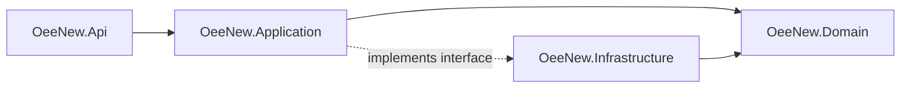
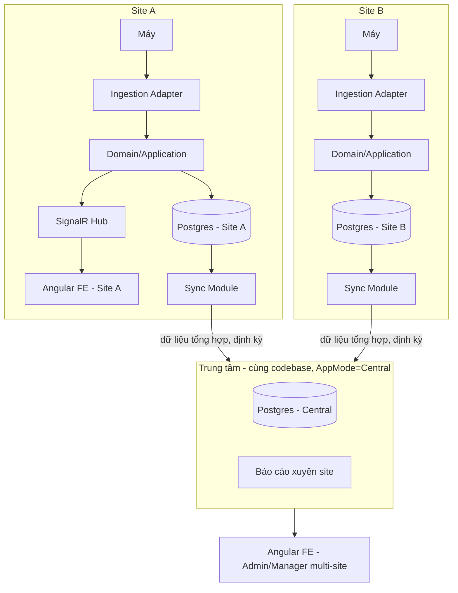
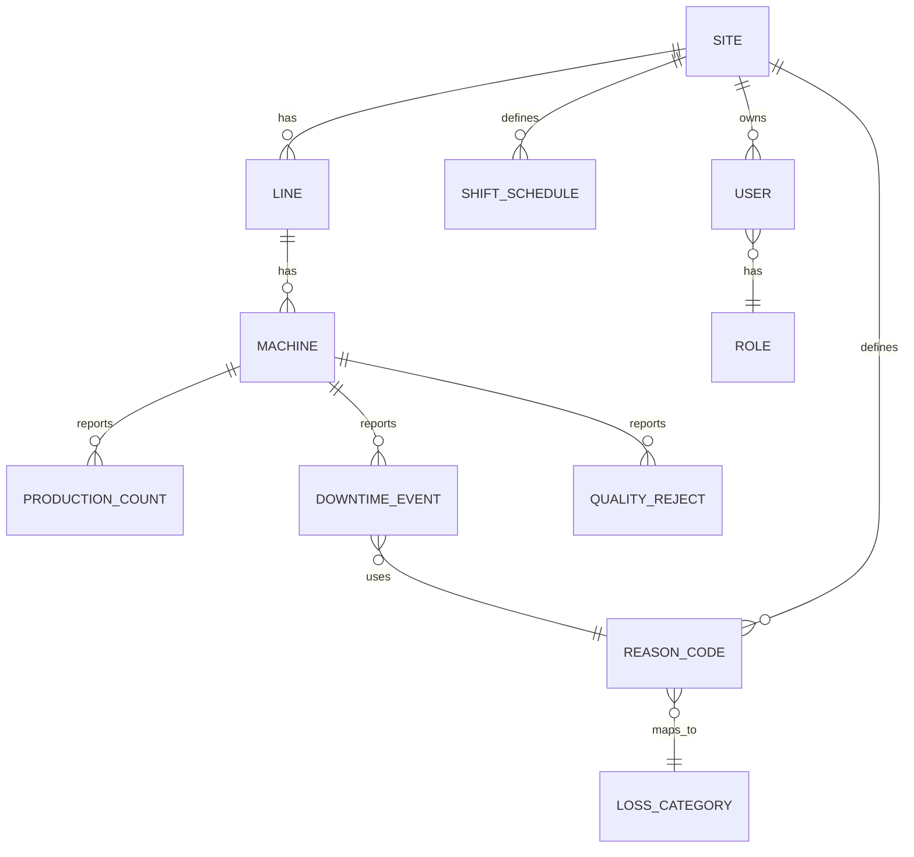

# Architecture Spine — oee-new

## Design Paradigm

**Layered Modular Monolith, replicated per site, với một Sync boundary riêng biệt.**

Mỗi site (nhà máy) chạy một instance độc lập của cùng một codebase .NET, tự vận hành hoàn toàn khi mất kết nối liên site. Trung tâm chạy **cùng codebase, ở chế độ khác** (`AppMode: Site | Central`), chỉ bật các module tổng hợp/báo cáo xuyên site.

Trong mỗi instance, 4 lớp map trực tiếp vào namespace:

- `OeeNew.Domain` — logic tính OEE, entity, value object. Không phụ thuộc EF Core/HTTP/SignalR. Test được độc lập.
- `OeeNew.Application` — use case (ghi nhận downtime, tính báo cáo ca, quản lý master data...).
- `OeeNew.Infrastructure` — EF Core + Postgres, ingestion adapter, SignalR hub, Sync module, xác thực JWT.
- `OeeNew.Api` — controllers/hub, mỏng, không chứa logic nghiệp vụ.

Không dùng CQRS/MediatR/Repository-pattern-vì-thích ở giai đoạn này — chỉ tách đủ để Domain test độc lập được (quyết định của Amelia trong phiên thảo luận, để không over-engineer khi chưa có user thật).

## Invariants & Rules

### AD-1 — Paradigm: Layered Modular Monolith replicated per site

- **Binds:** toàn bộ hệ thống (all)
- **Prevents:** site build kiến trúc khác nhau (microservices ở site này, monolith ở site khác); logic OEE lẫn vào controller không test được
- **Rule:** Domain không được reference Infrastructure hay Api. Application chỉ được gọi Domain + abstraction (interface) của Infrastructure, không gọi thẳng EF Core/HTTP client. Api chỉ gọi Application, không chứa business logic.



### AD-2 — Site tự trị, Trung tâm chỉ tổng hợp

- **Binds:** FR-001..003 (ingestion), NFR-2, NFR-3, NFR-4
- **Prevents:** site ngừng hoạt động khi mất kết nối liên site; trung tâm trở thành single point of failure cho vận hành hàng ngày
- **Rule:** Mỗi site có Postgres DB riêng, vận hành đầy đủ (ingestion, dashboard, ghi downtime) mà không cần kết nối tới trung tâm. Qua Sync, site chỉ đẩy lên trung tâm **bản ghi nghiệp vụ đã hoàn thiện** — `DowntimeEvent` khi đã đóng (máy chạy lại), `ProductionCount` tổng theo khung giờ (vd. mỗi giờ), `QualityReject` theo bản ghi — **không phải luồng tín hiệu thô liên tục** (raw counter/status event từ máy). Đây là các entity named ở AD-6; "tổng hợp" nghĩa là mức bản ghi nghiệp vụ đã chốt, không phải số liệu thống kê rút gọn.



### AD-3 — Ingestion Adapter Pattern

- **Binds:** FR-001, FR-002, FR-003
- **Prevents:** phải sửa Domain/DB mỗi khi thêm một loại máy/giao thức mới; hai adapter hiểu khác nhau về ý nghĩa `counter`/`status` dẫn đến tính OEE sai
- **Rule:** `Domain`/`Application` chỉ biết interface `IProductionDataSource` (nhận: `machine_id`, `timestamp`, `counter`, `status` — đã chuẩn hoá), với ngữ nghĩa cố định: **`counter` là giá trị luỹ kế (cumulative) tại thời điểm báo cáo, không phải delta**; **`status` là một enum cố định** `Running | Stopped | Idle | Fault` (không phải chuỗi tự do). Giao thức máy thật (OPC-UA/MQTT/Modbus/thủ công) là implementation trong `Infrastructure`, không rò rỉ lên Application/Domain.

### AD-4 — Master data thuộc sở hữu của từng site (trừ credential đăng nhập)

- **Binds:** FR-011..015
- **Prevents:** trung tâm trở thành single point of configuration bắt buộc; site không tự thêm được máy/line/mã lý do khi cần gấp; hai module (site-write, central-proxy) cùng có quyền ghi vào site khiến dữ liệu xung đột
- **Rule:** Site, Line, Machine, ShiftSchedule, ReasonCode, và **phần gán vai trò + phạm vi site/line của User** (role scoping) là dữ liệu **ghi tại site**, không ghi tại trung tâm. Trung tâm chỉ đọc các entity này qua Sync (một chiều: site → trung tâm), **không có bất kỳ endpoint nào ở trung tâm proxy/forward ghi ngược xuống site** — kể cả khi gọi bằng JWT Admin hợp lệ toàn cục (xem AD-7): muốn sửa dữ liệu của site nào, phải gọi thẳng vào API của site đó, không qua trung tâm. Riêng **credential đăng nhập** (username/password/token issuance) của User không thuộc nhóm này — xem AD-7.

### AD-5 — Reason code cục bộ, taxonomy tổn thất toàn cục

- **Binds:** FR-009, FR-014, FR-019
- **Prevents:** báo cáo xuyên site không so sánh được vì mỗi site đặt mã lý do khác nhau tự do; hai team implement việc map lý do → nhóm tổn thất theo hai cách khác nhau (bắt buộc vs tuỳ chọn)
- **Rule:** Mỗi site tự định nghĩa danh sách `ReasonCode` riêng, nhưng cột `LossCategory` trên `ReasonCode` **bắt buộc ở mức schema DB** (`NOT NULL`, kiểu enum `AvailabilityLoss | PerformanceLoss | QualityLoss`) — không phải validation tuỳ chọn ở tầng ứng dụng. Báo cáo/pie chart xuyên site (FR-019) chỉ được tổng hợp theo taxonomy toàn cục này, không theo tên mã cụ thể.

### AD-6 — Định danh: GUID cho mọi entity đồng bộ

- **Binds:** tất cả entity đồng bộ lên trung tâm theo AD-2 (`DowntimeEvent`, `ProductionCount`, `QualityReject`) cùng `Machine`, `Line`, `ReasonCode`
- **Prevents:** đụng độ khoá chính khi hai site độc lập sinh cùng một ID (vd Machine #5 ở cả site A và B) rồi đồng bộ lên chung một bảng trung tâm; lỗi phân mảnh chỉ mục nếu tự sinh UUID sai cách
- **Rule:** Mọi entity đồng bộ dùng `uuid` làm khoá chính, sinh bằng hàm **`uuidv7()` gốc của PostgreSQL 18** (không dùng `Guid.CreateVersion7()` phía .NET — có lỗi thứ tự byte/không đơn điệu đã ghi nhận trên runtime .NET, gây phân mảnh B-tree giống hệt vấn đề UUIDv7 vốn để tránh). Sinh tại site lúc tạo record, không round-trip xin ID từ trung tâm.

### AD-7 — Identity tập trung, xác thực offline-first tại site

- **Binds:** NFR-5, FR-006, FR-013, FR-015, FR-017
- **Prevents:** Admin không đăng nhập được vào site khác bằng cùng tài khoản; site bắt buộc phải online liên tục để xác thực mọi request; site mới tạo Operator local không đăng nhập được (mâu thuẫn với AD-4)
- **Rule:** **Credential đăng nhập** (username/password hash, token issuance) cho **mọi** user — kể cả Operator/Manager/Viewer cục bộ của site — được tạo và lưu bởi **Identity Provider trung tâm**, phát hành JWT chứa claim vai trò (`role: Admin` là claim toàn cục) + claim `siteId`/`lineIds` (lấy từ role-scoping data site đã đồng bộ lên, theo AD-4). Việc **gán vai trò/phạm vi site-line** cho user vẫn là thao tác thực hiện tại site (AD-4); việc **tạo credential đăng nhập ban đầu** cho user mới yêu cầu site liên lạc được trung tâm ít nhất một lần (đây là đánh đổi được chấp nhận — không xảy ra liên tục, khác với việc *xác thực* request hàng ngày). Mọi site instance + trung tâm cache **tối thiểu 2 signing key** (hiện tại + kế trước) từ JWKS trung tâm; token ký bằng key đã rotate vẫn được chấp nhận tới khi hết hạn riêng của token đó (không thu hồi ngay khi site đang offline). Authorization (Manager/Operator/Viewer, giới hạn site/line) được enforce ở tầng API (policy-based) tại chính site, không chỉ ẩn/hiện UI.

### AD-8 — Real-time qua SignalR

- **Binds:** FR-004, FR-005
- **Prevents:** dashboard xưởng dùng polling gây độ trễ và tải server không cần thiết; hai team dựng dashboard khác nhau chọn cơ chế real-time khác nhau
- **Rule:** Mỗi site instance có một SignalR hub; Angular FE của site đó subscribe qua hub này để nhận cập nhật trạng thái máy trong vài giây. Trung tâm không cần real-time xuyên site (chỉ dữ liệu tổng hợp định kỳ theo AD-2).

## Consistency Conventions

| Concern | Convention |
| --- | --- |
| Naming (entities, files, interfaces) | .NET: PascalCase (class/interface `IProductionDataSource`), namespace theo layer (`OeeNew.Domain.*`). Angular: kebab-case file/selector, PascalCase class, camelCase field/method. |
| ID | `Guid` cho mọi entity đồng bộ lên trung tâm (AD-6); cho phép `int` tự tăng cho dữ liệu thuần cục bộ không bao giờ sync (vd. audit log nội bộ). |
| Ngày giờ | ISO 8601, UTC khi lưu trữ/truyền API; hiển thị theo giờ địa phương site ở FE. |
| API error shape | Envelope chuẩn `{ code, message, details? }`, mã lỗi theo HTTP status + code nghiệp vụ riêng (không lộ exception .NET ra ngoài). |
| Auth | JWT Bearer; claim `role` (Admin = toàn cục) + claim `siteId`/`lineIds` cho Manager/Operator/Viewer (AD-7). Policy-based authorization ở API, kiểm tra lại ở Application layer cho use case ghi dữ liệu. |
| Real-time | SignalR hub theo site (AD-8); tên event dạng `MachineStatusChanged`, `DowntimeReasonRecorded`. |
| i18n | Resource key dạng `feature.section.label`. FE dùng **`@ngx-translate/core`** (không dùng Angular built-in i18n — built-in yêu cầu build riêng theo từng locale, không hỗ trợ chuyển ngôn ngữ tại runtime mà FR-007 yêu cầu). BE trả message code, không trả text cứng, để FE tự dịch. |

## Stack

| Name | Version |
| --- | --- |
| .NET | 10.0 (LTS, hỗ trợ tới 11/2028) |
| Angular | 21 (LTS tới 19/5/2027) — lùi từ 22 vì PrimeNG 22 vướng license mới, xem hàng dưới |
| PrimeNG | 21 (xác nhận chính thức tương thích Angular 21, phát hành trước khi PrimeNG chuyển license sang PrimeUI ở bản 22) |
| PostgreSQL | 18.4 (bản minor mới nhất của major 18 ổn định cho production) |
| SignalR | đi kèm ASP.NET Core 10.0 |
| EF Core | 10.0 (khớp .NET 10) |

## Structural Seed

### Deployment & Environments

- Mỗi site: 1 server on-premise tại nhà máy (Windows Server hoặc Linux), chạy `OeeNew.Api` (`AppMode=Site`) + PostgreSQL 18 local.
- Trung tâm: 1 instance riêng (on-premise tại văn phòng chính hoặc site chính), chạy cùng binary (`AppMode=Central`) + PostgreSQL 18 riêng cho dữ liệu tổng hợp.
- Identity Provider: đồng hành cùng instance trung tâm (có thể là module trong `OeeNew.Infrastructure` hoặc ASP.NET Core Identity + JWT issuer); mỗi site cache JWKS định kỳ.
- **Backup/DR:** mỗi site tự backup Postgres cục bộ (vd. `pg_dump`/WAL archiving định kỳ) — bắt buộc phải quyết định trước go-live vì DB site là nguồn dữ liệu duy nhất giữa hai lần sync; tần suất/retention cụ thể để lại cho Sprint Planning/Ops, không phải invariant kiến trúc.
- **Rollout/cập nhật:** cập nhật ứng dụng cho N site on-premise cần một cơ chế thống nhất (script/CI đẩy release tới từng site) — cơ chế cụ thể chưa chọn, xem Deferred.
- **Observability:** trung tâm phải thấy được "site nào đang mất kết nối/mất đồng bộ bao lâu" ở mức tối thiểu (dựa trên timestamp Sync gần nhất) — đây là hệ quả bắt buộc của AD-2 (autonomy) để tránh hiểu nhầm site đang im lặng là site không hoạt động. Observability chi tiết hơn (log tập trung, alerting hạ tầng) — xem Deferred.
- **Dev/Staging:** chưa xác định, xem Deferred.

### Core-Entity ERD (tên + quan hệ, không liệt kê hết thuộc tính)



### Source Tree

```text
oee-new/
  src/
    OeeNew.Domain/        # entity, value object, logic tính OEE - không dependency ra ngoài
    OeeNew.Application/    # use case, interface cho Infrastructure (IProductionDataSource, ISyncClient...)
    OeeNew.Infrastructure/ # EF Core+Postgres, ingestion adapters, SignalR hub, Sync module, JWT/JWKS
    OeeNew.Api/            # controllers, SignalR hub endpoint, appsettings AppMode=Site|Central
  web/
    oee-shell/             # Angular app, PrimeNG components
      src/app/dashboard/   # FR-004..007, FR-019..021 (pie chart, filter Equipment/Area, drill-down ngày)
      src/app/downtime/    # FR-008..010
      src/app/master-data/ # FR-011..014
      src/app/reports/     # FR-016..018
```

## Capability → Architecture Map

| Capability / Area | Lives in | Governed by |
| --- | --- | --- |
| Ingestion (FR-001..003) | `Infrastructure` (adapter) → `Application` qua `IProductionDataSource` | AD-3 |
| Dashboard real-time + pie chart (FR-004..007, FR-019..021) | `Api` SignalR hub + `web/oee-shell/dashboard` | AD-8, AD-6 (filter theo Equipment/Area dùng Guid) |
| Downtime & reason code (FR-008..010) | `Application` use case + `Domain` (OEE calc) | AD-5 |
| Master data & phân quyền (FR-011..015, FR-006, FR-017) | `Application`/`Infrastructure` (site-local role-scoping) + Identity Provider trung tâm (credential, claim) | AD-4, AD-7 |
| Báo cáo (FR-016..018) | site instance (báo cáo site) + trung tâm (báo cáo xuyên site, AppMode=Central) | AD-2, AD-5 |

## Deferred

- Adapter giao thức máy cụ thể (OPC-UA/MQTT/Modbus) — chưa biết máy thật, viết khi tích hợp thực tế (chỉ cần tuân AD-3).
- Cơ chế/tần suất chính xác của Sync module (batch interval, giao thức truyền — REST polling hay message queue) — quyết định khi có hạ tầng mạng liên site thực tế; grain đã cố định ở AD-2/AD-6.
- Alerting tự động khi OEE thấp — ngoài phạm vi MVP (theo PRD mục 7).
- Module chất lượng/phế phẩm chi tiết (root-cause, SPC) — ngoài phạm vi MVP.
- Timeline triển khai và site thí điểm đầu tiên — quyết định ở Sprint Planning, không phải Architecture.
- Chi tiết UX/màn hình cụ thể (bố cục dashboard, thứ tự thao tác) — thuộc `bmad-ux`.
- Chu kỳ refresh JWKS cụ thể (bao lâu site pull key mới một lần) — chi tiết implementation; số lượng key cache tối thiểu (2) và quy tắc chấp nhận token đã ở AD-7.
- Cơ chế rollout cập nhật ứng dụng tới N site on-premise (script thủ công, CI/CD, hay agent tự cập nhật) — quyết định khi biết số lượng site thực tế cần vận hành.
- Tần suất/retention backup Postgres cụ thể tại mỗi site — Ops quyết định trước go-live.
- Observability/log tập trung chi tiết (ngoài "last-sync-timestamp" tối thiểu đã cố định) — quyết định cùng lúc chọn cơ chế rollout.
- Môi trường Dev/Staging — chưa thiết lập, quyết định khi có kế hoạch CI/CD.
- Enforcement tự động cho AD-1 (vd. architecture test bằng NetArchTest để chặn Domain reference Infrastructure trong CI) — khuyến nghị, không phải invariant bắt buộc ngay.
